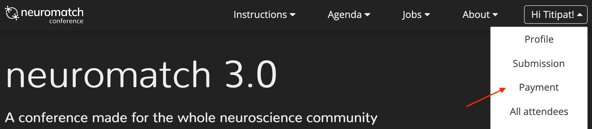

### Registration / Signup

- You can register on top of this page for Neuromatch conference using your email, Gmail, or GitHub handle.

- If you previously signed up for Neuromatch conferences, you still have to [edit your profile](/edit-profile) under your log-in profile to register for the Neuromatch conference 4 (NMC4).
- After signing up, provide basic information about you, including your abstracts if you want to participate in the **mind-matching** (1-on-1 matching) part of the conference.
- You can always come back to edit your profile anytime before the registration ends.
- Make sure to choose if you want to participate in the matching component. That is where the fun is. But make sure you do it before the registration ends.
- After the registration ends, we will perform a matching algorithm. You will have an access to your matches under your profile to see your partners.
- We also add local meetups features (coming soon) where you can host or attend local meetups near you at NMC4.

----

### Registration Fees

Registration is required to attend the conference, including to have an abstract presented. *The registration fee is $15 per person and a fee waiver is available* for those who cannot have their fee covered by either their institution, company, or lab and cannot pay on their own (no validation necessary) or lack the technical means to use our payment portal. Consistent with our values of making the meeting accessible as possible, we have minimized the cost to attend while still providing the financial support necessary to increase the scope and impact of the meeting beyond previous offerings. With the fee waiver, we want to explicitly guarantee that no one is unable to participate due to funding status.

----

### Mind-matching Instructions (1-on-1 meeting)

We use machine learning algorithm to match conference attendees together for one-on-one meeting, so called "mind-matching". To sign up, opt-in to the matching part to matching part in your registration profile and provide us your representative abstract.

#### Preparation

- Preparation
  - If you signed up for mind-match, we will send your match partners on your matches page a few days after the registration ends. You will get who your partners are and suggestions on how to e-meet them before, during, or after the main conference.
  - You can exchange emails with your match partners to organize a time and meeting platforms (Skype/Zoom/etc.) beforehand. Please don't forget to include your timezone!
  - You and your match are responsible for setting up the conversation, we just arrange the matches.
- Before the meeting with your match
  - Have a quick look at your partner’s webpage or list of publications (a link will be included in the email we send you), but there is no expectation that you will read their papers.
  - Think about how to quickly describe your research interests bearing in mind your partner’s background. This is particularly important for interdisciplinary meetings.
- Recommendation during the meeting
  - Start by each of you talking for 1 - 2 minutes about your general interests and approach.
  - If you immediately see a point of connection, go for it and talk about that.
  - Feel free to use screen-sharing and your slides if you think they help.
  - If not, try each of you describing briefly one or two projects that you think would be relevant or interesting to the other one, and see if that sparks an interesting discussion.
  - Keep in mind, the idea is to give yourselves the best chance of finding an unexpected and useful connection, so think broadly and try to get across a range of ideas until you find something that gets you both excited that you can talk about in more detail.
  - Please be kind and respectful during your meeting (see more on our code of conduct page).
  - Don’t worry if you don’t find something, our algorithms aren’t perfect and you’re not being judged on how well you do - have fun!

----

### Further questions

If you have further questions, please consult our [FAQ page](/faq) first. If you cannot find your solution, you can contact us at `nmc@neuromatch.io`.
